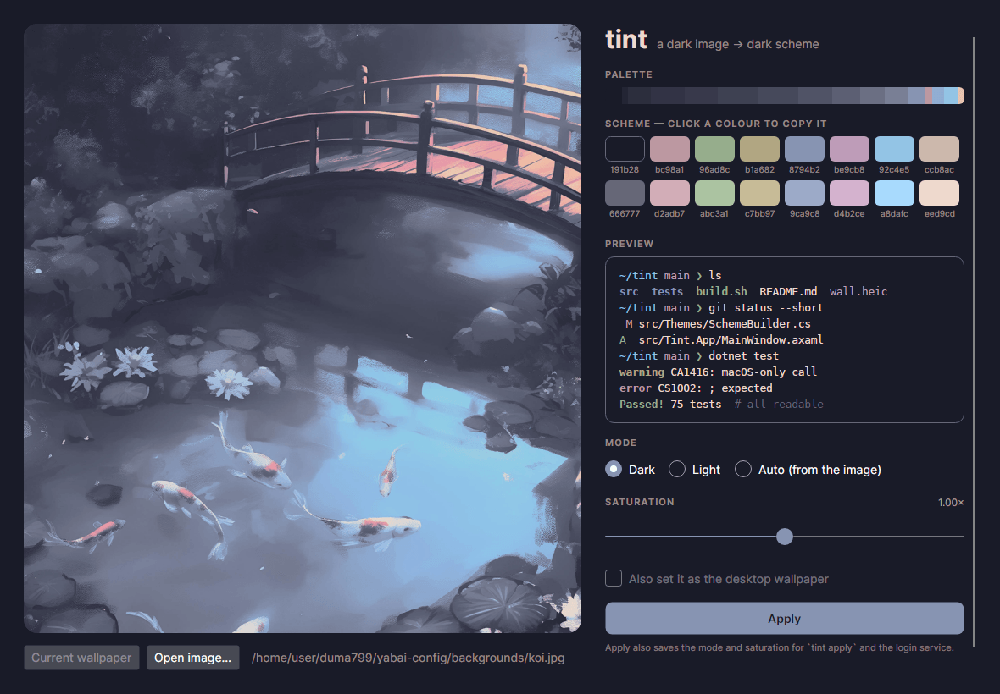

# tint

Colour themes from your wallpaper, for **macOS**. Written in C#.

Change the wallpaper and tint extracts its palette, builds a readable terminal
colour scheme from it, and writes it where your setup looks for it — the job
pywal does, rebuilt with readable-contrast checks and a watcher that
understands how macOS stores wallpapers, including the built-in ones.

What it does, end to end:

- **watches the wallpaper** — photos, pictures, and the built-in ones that have
  no image file (Neptune…) — and themes from each new one;
- **builds a readable 16-colour scheme**: accents matched to their terminal
  role by hue, every colour checked for contrast;
- **writes pywal's files** to `~/.cache/wal`, so existing configs keep working,
  plus Ghostty and WezTerm themes;
- **reloads SketchyBar, JankyBorders and Ghostty** itself, then runs your hook;
- **runs at login** as a launchd agent, and `tint doctor` checks the setup;
- a **desktop app** to pick an image, preview the scheme, tweak it and apply.

## Install

With [Homebrew](https://brew.sh):

```sh
brew tap duma799/tint https://github.com/duma799/tint
brew install duma799/tint/tint             # the command (full name: Homebrew has another "tint")
brew install --cask duma799/tint/tint-app  # the desktop app (optional)
tint service install              # theme on every wallpaper change, from login
tint doctor                       # check everything is wired up
```

From source (needs the [.NET 10 SDK](https://dotnet.microsoft.com/download): `brew install --cask dotnet-sdk`):

```sh
git clone https://github.com/duma799/tint && cd tint
dotnet pack src/Tint.Cli -c Release -o ./artifacts
dotnet tool install --global --add-source ./artifacts tint     # `update` instead of `install` next time
dotnet run --project src/Tint.App                               # the desktop app
```

The command lands in `~/.dotnet/tools`; add that to your `PATH`.

## Use

```sh
tint apply                      # theme from the current wallpaper
tint apply ~/Pictures/city.jpg  # …or from any image
tint apply city.jpg -w          # …and make it the wallpaper too
tint apply -m light -s 1.2      # light scheme, a bit more colourful
tint watch                      # re-theme on every wallpaper change (in this terminal)
tint service install            # …the same, in the background from login
tint doctor                     # what's set up, what isn't, what to fix
tint app                        # open the desktop app
tint palette ~/Pictures/city.jpg
tint wallpaper                  # print the current wallpaper
```

`tint apply` builds a 16-colour scheme from the image — each accent matched to
its terminal role by hue, and every colour checked for readable contrast
against the background (WCAG 4.5:1 for text, 7:1 for the foreground) — then:

1. writes pywal's files to `~/.cache/wal`: `colors.json`, `colors`, `colors.sh`,
   `colors.css`, `colors-kitty.conf`, `colors-wal.vim` — anything that already
   reads them keeps working, e.g. SketchyBar configs reading `colors.json`,
   JankyBorders reading `colors.sh`, Neovim with pywal.nvim — plus
   `colors-ghostty` and `colors-wezterm.toml`;
2. renders your pywal templates from `~/.config/wal/templates` (same syntax:
   `{color4}`, `{color4.strip}`, `{{ }}`…);
3. reloads the apps below, if they're running;
4. runs `~/.config/tint/hooks/post-apply` if it exists, with `TINT_WALLPAPER`,
   `TINT_MODE` and `TINT_CACHE` set — for anything else (editor themes…).

### Apps it reloads

| App | How |
|---|---|
| **SketchyBar** | `sketchybar --reload`, which re-runs your `sketchybarrc` |
| **JankyBorders** | runs `~/.config/borders/bordersrc` (it should read `colors.sh`); without one, sets the active border to color4 and the inactive one to color8. Calling `borders` with options updates the running instance — no restart |
| **Ghostty** 1.2+ | sends it `SIGUSR2` (reload config). Add to its config: `config-file = ~/.cache/wal/colors-ghostty` |
| **WezTerm** | nothing to send — it reloads when a watched file changes. In `wezterm.lua`: |

```lua
local tint = wezterm.home_dir .. '/.cache/wal/colors-wezterm.toml'
wezterm.add_to_config_reload_watch_list(tint)
local ok, colors = pcall(wezterm.color.load_scheme, tint)
if ok then config.colors = colors end
```

### Settings

`--mode` (dark, light, auto) and `--saturation` (0.5–1.5) default to
`~/.config/tint/settings.json`, else dark and 1. The desktop app saves them
when you press Apply, so the login service uses them too.

### The login service

`tint service install` writes `~/Library/LaunchAgents/io.github.duma799.tint.plist`
and starts it: launchd runs `tint watch` now and at every login, and restarts
it if it crashes. It gets your shell's `PATH` (launchd's own has no Homebrew),
and logs to `~/Library/Logs/tint.log`. Also: `tint service status`,
`restart` (after updating tint), `uninstall`.

If something else themes from an image first — `tint apply -w`, the app —
the watcher sees the wallpaper is already themed and leaves it.

### The desktop app

Opens on the current wallpaper (or drop in / open any image) and shows its
palette, the 16-colour scheme and a terminal preview — the whole window takes
the scheme's colours. Switch dark/light/auto, turn the saturation up or down,
optionally make the image the wallpaper, and Apply. Click a colour to copy it.



## How the watching works

Changing the wallpaper rewrites
`~/Library/Application Support/com.apple.wallpaper/Store/Index.plist`. tint
watches that folder, waits until the burst of writes has been quiet for 400 ms,
then checks the wallpaper once and reacts only if it actually changed.

It finds the image in this order:

1. **System Events** — works for most photos and pictures.
2. **`Store/Index.plist`** — the picture's file URL, stored inside a nested
   `Configuration` plist.
3. **macOS's rendered snapshot** — for wallpapers with no image file at all,
   like the macOS 26 extension wallpapers (Neptune…). The wallpaper service
   keeps full-size renders in
   `~/Library/Containers/com.apple.wallpaper.agent/…/extension-<provider>/`, and
   tint uses the newest one. No screen recording needed.

The first run may ask for permission for your terminal to control **System
Events** and to **access data from other apps** (the snapshot cache belongs to
the wallpaper service). HEIC images are converted with the system's `sips`.

## Layout

```
src/
  Tint.Core/         no UI
    Colors/          Rgb, Lab (CIELAB), WCAG contrast
    Palettes/        k-means clustering, PaletteExtractor
    Themes/          SchemeBuilder: palette → 16-colour scheme
    Output/          pywal-compatible files, Ghostty/WezTerm themes, templates
    Reload/          SketchyBar, JankyBorders, Ghostty, the post-apply hook
    Service/         the launchd agent
    Diagnostics/     tint doctor
    Imaging/         image loading (+ HEIC via sips)
    Wallpapers/      macOS wallpaper watching, lookup and setting
  Tint.Cli/          the `tint` command
  Tint.App/          the desktop app (Avalonia)
tests/
  Tint.Core.Tests/   xUnit
  Tint.App.Tests/    the app, run headless
scripts/
  package.sh         release files for one architecture
  homebrew.sh        the formula and cask for a release
```

### Palette extraction

The image is shrunk so its long side is at most 256 px, every pixel is
converted to CIELAB — a colour space where distance matches how different
colours *look* — and k-means groups them into 16 clusters. Each cluster's
average is a palette colour, and its size is how much of the image it covers.
Seeding is fixed, so the same image always yields the same palette.

## Development

```sh
dotnet build
dotnet test
dotnet format          # fix formatting; CI runs it with --verify-no-changes
```

CI builds and tests on macOS for every pull request, and the Release workflow
builds the Mac files too (attached to the run). Merging a new `<Version>` in
`Directory.Build.props` into main publishes release `vX.Y.Z` and updates the
Homebrew formula and cask.

`TINT_SCREENSHOTS=/some/dir dotnet test` also saves pictures of the app (add
`TINT_SCREENSHOT_IMAGE=wall.jpg` to use a real wallpaper).

## Roadmap

1. ~~**Core** — palette extraction, macOS wallpaper watching (photos, plist, built-in snapshots)~~
2. ~~**Themes** — readable schemes, pywal-compatible output, templates, hooks,
   SketchyBar / JankyBorders / Ghostty reloads, WezTerm theme~~
3. ~~**Service** — `tint service install` (LaunchAgent), `tint doctor`~~
4. ~~**Desktop app** — pick a wallpaper, preview, tweak, apply~~
5. ~~**Releases** — self-contained Mac builds, Homebrew formula and cask~~
6. **Next** — Zed and VS Code themes; `tint back` (previous theme); a menu-bar item

## License

[GPL-3.0-or-later](LICENSE). You can use, study, change and share tint; if you
distribute a modified version, its source must be available under the same
license.

Images are decoded with [ImageSharp](https://github.com/SixLabors/ImageSharp)
(Six Labors Split License — Apache-2.0 for open-source projects like this one).
